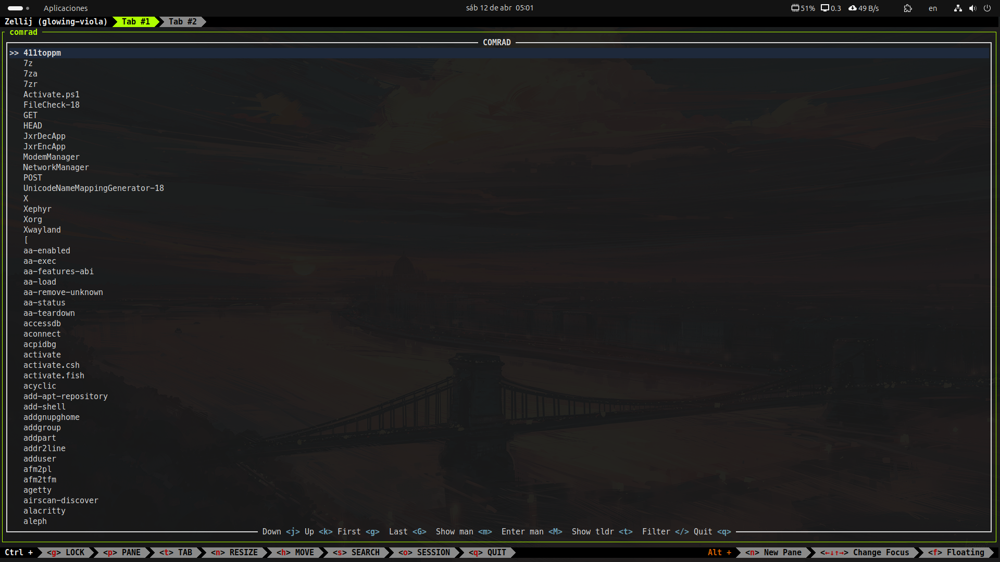
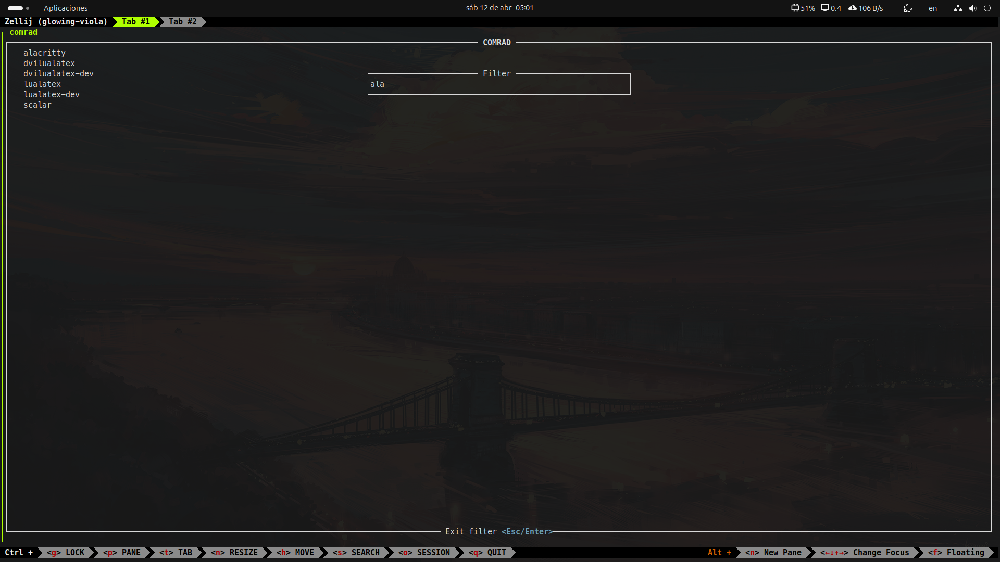
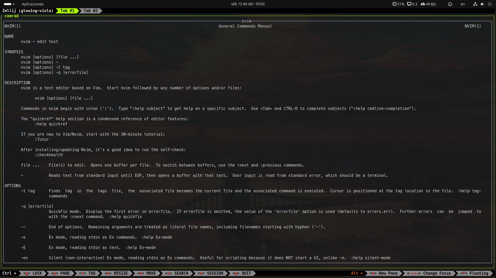
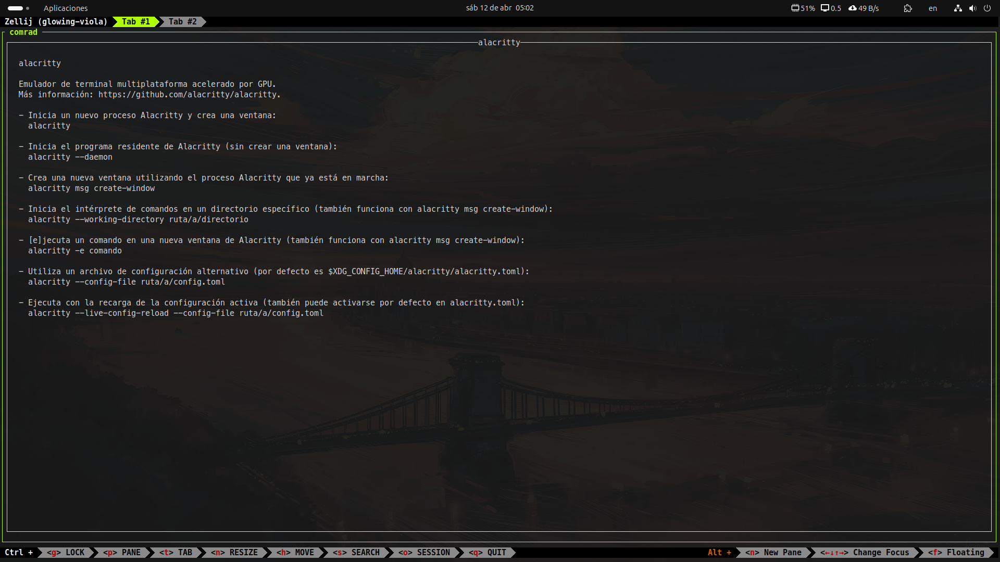

# COMRAD

A simple TUI tool made with [ratatui](https://ratatui.rs/) that shows all the terminal commands available in your computer.

# Installation

## Pre-requisites
You must have [Rust](https://www.rust-lang.org/tools/install) installed in your computer and be able to run the `cargo` command.

## Installation

1. Clone the repository
```
git clone https://github.com/UnMolDeQuimica/Comrad.git
```

2. Build the project
```
cargo build --release
```

3. Install it globally
```
cargo install --path
```

4. Run comrad
```
comrad
```

# Usage

Run the `comrad` command to enter the TUI.

You can move up and down with j and k or using the up and down arrow keys.

You can go to the first entry pressing 'g' and to the last entry pressing 'G'.

Press '/' to enter filter mode.

Press 'm' to show the `man` page of the current command (only available if you have `man` installed).

Press 'M' to enter the `man` page of the current command (only available if you have `man` installed).

Press 't' to show the `tldr` page of the current command (only available if you have `tldr` installed).

Press 'q' to exit comrad.

# Gallery

## Comrad TUI


## Comrad Filter


## Comrad Man Page


## Comrad TLDR Page

